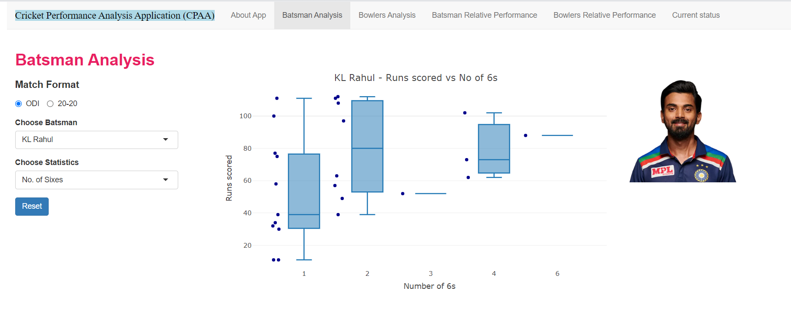

# CPAA: Shiny Analysis of Cricket


<p align="center">
  
</p>

## Overview


**Cricket Performance Analysis Application (CPAA)** is an interactive R Shiny web application for comprehensive analysis of player performance in T20 and ODI cricket. The app provides actionable insights into player strengths, weaknesses, and trends using real data sourced from [ESPN Cricinfo](https://www.espncricinfo.com).


Whether you're a cricket fan, analyst, or researcher, CPAA gives you a visually engaging and data-driven way to explore cricket statistics.


---


## Features


- **Detailed Player Metrics**: Analyze batting averages, strike rates, bowling economy rates, and more.

- **Interactive Comparison**: Compare statistics across players, matches, and series.

- **Performance Trends**: Visualize player and team performance over time.

- **Custom Analysis Tabs**: Separate tabs for Batsman Analysis, Bowler Analysis, Relative Performance, and Current Status.

- **Dynamic Visuals**: Bar charts, box plots, line plots, and summary tables.

- **Player Image Gallery**: Integrated player images for enhanced user experience.

- **Clean UI/UX**: Intuitive navigation and responsive design.


---


## Application Structure


| File / Folder            | Description |

|------------------------- |-------------|

| `app.R`, `ui.R`, `server.R` | Main files to launch the Shiny app. (`app.R` is the single-file alternative; `ui.R`/`server.R` for modular structure) |

| `BatsmanAnalysis.R`      | Maps chosen batsman to their data file; maps Shiny UI statistics to analysis functions for the Batsman Analysis tab. |

| `batsmanFunction.R`      | Contains all function definitions used by `BatsmanAnalysis.R`. |

| `clean.R`                | Functions to clean and preprocess raw batsman data files. |

| `BowlerAnalysis.R`       | Maps chosen bowler to their data file; maps Shiny UI statistics to analysis functions for the Bowler Analysis tab. |

| `bowlerFunction.R`       | Contains all function definitions used by `BowlerAnalysis.R`. |

| `cleanbowl.R`            | Functions to clean and preprocess raw bowler data files. |

| `BatsmanRelPerf.R`       | Handles mapping and analysis for the Relative Batsman Performance tab. |

| `BowlerRelPerf.R`        | Handles mapping and analysis for the Relative Bowler Performance tab. |

| `status_check.R`         | Maps players to data files and provides statistical tests for the Current Status tab (e.g., form analysis). |

| `odi/`, `tt/`            | Folders containing raw data files for different match formats (ODI and T20). |

| `www_batsman/`, `www_bowler/` | Folders containing player images for use in the Shiny app UI. |


---


## Screenshots


### Home & Overview


### Batsman Analysis




### Bowler Analysis


### Relative Performance


### Current Status (Form Analysis)


---


## How to Run the App


1. **Clone the repository:**

&nbsp;   ```bash

&nbsp;   git clone https://github.com/SwatiNeha/cpaa-shiny-cricket.git

&nbsp;   cd cpaa-shiny-cricket

&nbsp;   ```


2. **Install required R packages:**

&nbsp;   ```r

&nbsp;   install.packages(c("shiny", "ggplot2", "dplyr", "readr", ...))

&nbsp;   ```


3. **Launch the app:**

&nbsp;   - If using `app.R`:

&nbsp;       ```r

&nbsp;       shiny::runApp()

&nbsp;       ```

&nbsp;   - If using `ui.R` and `server.R`:

&nbsp;       ```r

&nbsp;       shiny::runApp(".")

&nbsp;       ```


---


## Data Source


All statistics are sourced from [ESPN Cricinfo](https://www.espncricinfo.com).


---


## Customization & File Descriptions


- **BatsmanAnalysis.R**: Maps batsman selections and UI statistics to relevant data and functions.

- **batsmanFunction.R**: Implements all core batsman analysis functions.

- **clean.R**: Preprocesses and cleans raw batsman data.

- **BowlerAnalysis.R**: Maps bowler selections and statistics in UI.

- **bowlerFunction.R**: Core functions for bowler analytics.

- **cleanbowl.R**: Preprocesses and cleans raw bowler data.

- **BatsmanRelPerf.R/BowlerRelPerf.R**: Handles all logic for relative performance comparisons.

- **status_check.R**: For current form analysis, mapping player data and performing tests.

- **odi/tt**: Store raw and cleaned data for different match formats.

- **www_batsman/www_bowler**: Store player images for use in the dashboard.


---


## Feedback & Contributions


I hope you find CPAA useful and insightful.  

**For feedback, suggestions, or contributions, please open an issue or pull request, or feel free to reach out!**


---


> “While similar Shiny apps exist, CPAA is my personal take with a focus on modularity, intuitive visualizations, and comprehensive cricket analysis. Building this project has helped me strengthen my R, Shiny, and data science skills.”


---


